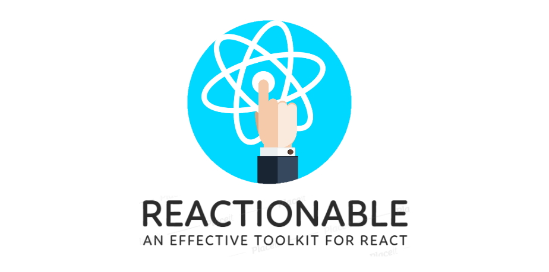

  
    
  
    
  
  

# Helping Project

❤️ If this project helps you reduce time to develop and/or you want to help the maintainer of this project. You can [sponsor](https://github.com/sponsors/neilime) him. Thank you !

# Contributing

👍 If you wish to contribute to __Reactionable__, please read the [CONTRIBUTING.md](CONTRIBUTING.md) file, PRs are Welcome !
